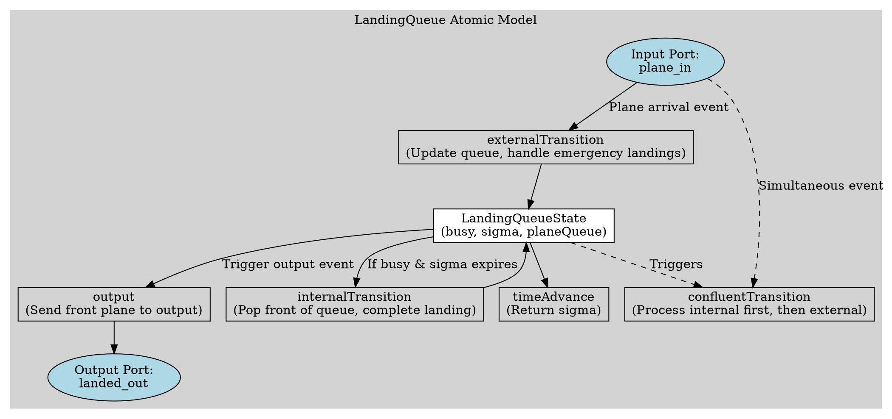
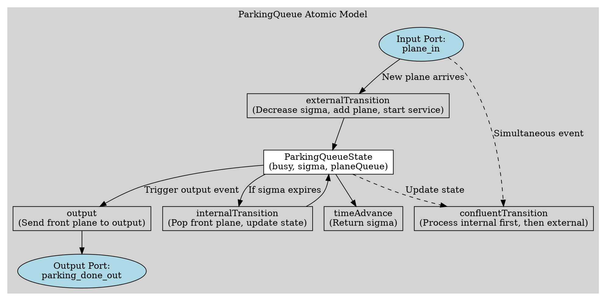
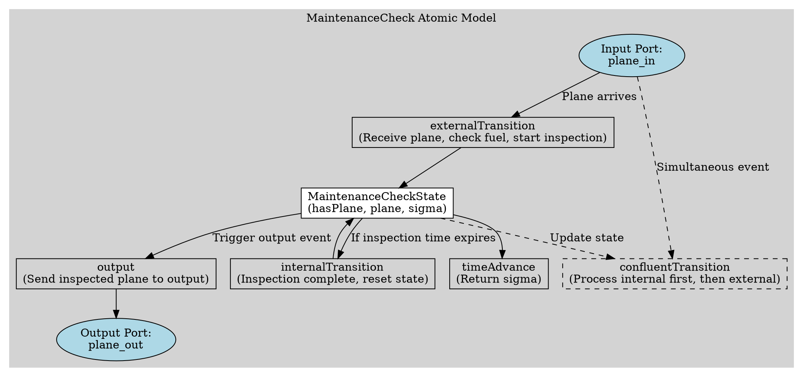

# CARLETON UNIVERSITY

## Department of Systems and Computer Engineering

### SYSC 5104: Methodologies for Discrete Event Modelling and Simulation

### Assignment 1

---

**William Wang**
**Student ID:** 101191168

## 1. Model Organization

### 1.0 Assignment Github Location

https://github.com/RTGTX7/Airport_Ground_Control/tree/main

### 1.1 Atomic Models

1. ​**Landing_Queue**​: Manages the airport landing queue, ensuring that planes land in order while prioritizing emergency landings. The internal logic follows a ​**First-In-First-Out (FIFO) principle**​, but also considers fuel emergencies for priority landings.
2. ​**Parking_Queue**​: Manages the scheduling of landed planes, ensuring they are parked in the order they arrive and proceed to subsequent processes (e.g., maintenance checks) after a short stay. It follows a ​**FIFO principle**​, meaning the first plane to arrive is the first to complete parking. Each plane requires a ​**fixed parking time of 5 seconds**​.
3. ​**MaintenanceCheck**​: Receives landed planes and checks for fuel levels or maintenance needs. If maintenance is required, the processing time is extended. Once completed, the plane is output to the system's external environment or the next stage.

### 1.2 Coupled Model

The core task of this coupled model is to ​**simulate the complete process of an aircraft from landing to maintenance inspection**​. Its responsibilities include:

1. **Receiving incoming planes** → Planes enter the **LandingQueue** to wait for landing.
2. **Managing landing priorities** → Considering **fuel status** and ​**FIFO**​, ensuring emergency landings are handled properly.
3. **Assigning parking spaces** → Once landed, planes move to the **ParkingQueue** for a short stay.
4. **Maintenance check** → Planes proceed to **MaintenanceCheck** for **fuel replenishment** or ​**maintenance inspection**​.
5. **Completing the full process** → Planes that have finished landing, parking, and maintenance are output.

* ​**External Input Port**​:
  * `airplane_in`: Receives new arriving planes (Plane).
* ​**External Output Port**​:
  * `finished_plane_out`: Outputs planes that have completed landing and maintenance.

#### 1.2.1 Hierarchical Structure and Coupling Scheme

```
main.cpp
├── Landing_Control.hpp  (Coupled Model: Handles Landing Process) 
│   ├── Landing_Queue.hpp  (Atomic Model)
│   ├── ParkingQueue.hpp  (Atomic Model)
│   ├── MaintenanceCheck.hpp  (Atomic Model)
```

* **`plane_input_reader`** (Input Stream) → `LandingQueue`
  * Reads aircraft data from an external file and sends plane data to `LandingQueue`.
* **`LandingQueue` → `ParkingQueue`**
  * Once a plane completes landing, it moves to the parking queue.
* **`ParkingQueue` → `MaintenanceCheck`**
  * After completing the parking process, the plane moves to the maintenance check phase.
* **`MaintenanceCheck` → `finished_plane_out`**
  * After maintenance is completed, the plane is output to the external system.

---

## 2. Formal Specification

### 2.1 Coupled Model：Landing_Control

<X, Y, {`landing_queue`, `parking_queue`, `maintenance_check`}, EIC, EOC, IC, SELECT>

X = {∅}
Y = {`final_out`}

EIC = {∅}

EOC  = {(`maintenance_check.plane_out`, `final_out`)}

IC  = {(`plane_input_reader.out`, `landing_queue.plane_in`),
(`landing_queue.landed_out`, `parking_queue.plane_in`),
(`parking_queue.parking_done_out`, `maintenance_check.plane_in`)}

SELECT({`plane_input_reader`, `landing_queue`, `parking_queue`, `maintenance_check`}) = `plane_input_reader`

SELECT({`landing_queue`, `parking_queue`, `maintenance_check`}) = `landing_queue`

SELECT({`parking_queue`, `maintenance_check`}) = `parking_queue`

### 2.2 Atomic DEVS

$$
\langle X, S, Y, \delta_{\text{int}}, \delta_{\text{ext}}, \lambda, \text{ta}\rangle
$$

##### 2.2.1 Landing_Queue (Atomic)



$X = \{\text{Plane}\}$

- Messages received on the input port `plane_in`, representing new incoming Plane objects waiting to land.

$S = \{\,(\text{planeQueue}, \text{busy}, \sigma)\,\mid \text{planeQueue} \in \text{deque<Plane>}, \, \text{busy} \in \{ \text{true}, \text{false} \},$
$\, \sigma \in \mathbb{R}^{+}_{0} \cup \{\infty\} \}$

- **planeQueue**: A `std::deque<Plane>` storing planes waiting to land.
- **busy**: A boolean variable indicating whether a plane is currently landing.​
- ​$\sigma$: Remaining landing time; if $\infty$, the system is idle, waiting for input.

$Y = \{\text{Plane}\}$

- Messages sent to the output port `landed_out`, indicating a plane has just completed landing.

$\delta\_{\text{int}} : S \to S$

- **Trigger Condition**​: When the landing timer expires (internal event occurs).-
- **State Update Rules​**:
  - Remove the **front plane** from `planeQueue` (this plane has landed).
  - If `planeQueue` is not empty, set: busy←true, σ←10.0(Next plane starts landing; fixed landing time is 10 seconds).
  - Otherwise, set: busy←false, σ←∞  (No planes are waiting, returning to idle state).

$\delta\_{\text{ext}} : S \times \mathbb{R}^{+} \times X \to S$

- Trigger Condition​: When a new plane arrives (external event) after time ee has elapsed.
- State Update Rules​:
  
  - **Subtract elapsed time**​: If $\sigma \neq \infty$, update: $\sigma \leftarrow \max(0, \sigma - e)$
  - **Insert plane into the queue**​: For each incoming plane `newPlane` received on `plane_in`:
    - If `newPlane.fuel < 5`, use: planeQueue.push_front(newPlane) (Emergency landing; plane goes to the front of the queue).
    - Otherwise, use: planeQueue.push_back(newPlane)(Normal queueing order).
  - ​**Start landing if idle**​: If busy=$\text{busy} = \text{false} \quad \text{and} \quad \text{planeQueue} \neq \emptyset$ then set: $\text{busy} \leftarrow \text{true}, \quad \sigma \leftarrow 10.0$ (Start a new landing process).

$\lambda : S \to Y$ ​

- Trigger Condition: Just before an internal event (when a landing is completed).

* ​Output Rule​:
  * If `planeQueue` is not empty, send the front plane to the `landed_out` port, indicating that it ​**has just completed landing**​.
  * If the queue is empty, there is no output.

$\text{ta} : S \to \mathbb{R}^{+}_{0}$, $\text{ta}((\text{planeQueue}, \text{busy}, \sigma)) = \sigma$

* If `busy` is ​true​, σ is usually ​10.0​.
* ​If `busy` is ​false​, σ is ∞, meaning the system is waiting for input.

##### 2.2.2 Parking_Queue (Atomic)



$X = \{\text{Plane}\}$

- Messages received on the input port `plane_in`, representing planes that have landed and are now arriving at the parking area.

$S = \{\,(\text{planeQueue}, \text{busy}, \sigma) \mid \text{planeQueue} \in \text{queue<Plane>},\, \text{busy} \in \{\text{true}, \text{false}\},\, \sigma \in \mathbb{R}^{+}_{0} \cup \{\infty\}\}$

- **planeQueue**: A `std::queue<Plane>` storing planes waiting for parking processing.
- **busy**: A boolean variable indicating whether a plane is currently being processed in the parking area.
- **$\sigma$**: Remaining parking service time; if $\sigma = \infty$, the system is idle and waiting for a new plane.

$Y = \{\text{Plane}\}$

- Messages sent on the output port `parking_done_out`, indicating that a plane has just completed its parking process.

$\delta_{\text{int}} : S \to S$

- **Trigger Condition**: When the parking service time expires (internal event occurs).
- **State Update Rules**:
  - Remove the **front plane** from `planeQueue` (this plane has completed parking).
  - If `planeQueue` is not empty, then set:
    $\text{busy} \leftarrow \text{true}$,
    $\sigma \leftarrow 5.0$
    (Start processing the next plane, with a fixed parking time of 5 seconds).
  - Otherwise, set:
    $\text{busy} \leftarrow \text{false}$,
    $\sigma \leftarrow \infty$
    (No planes waiting; system becomes idle).

$\delta_{\text{ext}} : S \times \mathbb{R}^{+} \times X \to S$

- **Trigger Condition**: When new plane(s) arrive (external event) after elapsed time $e$.
- **State Update Rules**:
  - **Subtract elapsed time**: If $\sigma \neq \infty$, update
    $\sigma \leftarrow \max(0, \sigma - e)$.
  - **Insert new plane(s)**: For each plane received on `plane_in`, append it to `planeQueue` using standard queue insertion.
  - **Start service if idle**: If the system is idle (i.e., $\text{busy} = \text{false}$) and `planeQueue` is not empty, then set:
    $\text{busy} \leftarrow \text{true}$,
    $\sigma \leftarrow 5.0$
    (Initiate the parking service for the next plane).

$\lambda : S \to Y$

- **Trigger Condition**: Just before an internal event (i.e., when a plane's parking service is completed).
- **Output Rule**:
  - If `planeQueue` is not empty, output the **front plane** to the `parking_done_out` port, indicating that it has just finished parking.
  - If the queue is empty, there is no output.

$\text{ta} : S \to \mathbb{R}^{+}_{0}$, $\text{ta}((\text{planeQueue}, \text{busy}, \sigma)) = \sigma$

- **Time Advance Function**:
  - When $\text{busy}$ is true, $\sigma$ is the fixed parking time (5.0 seconds).
  - When $\text{busy}$ is false, $\sigma = \infty$, meaning the system is waiting for input.

##### 2.2.3 Maintenance_Check (Atomic)



$X = \{\text{Plane}\}$

- Messages received on the input port `plane_in`, representing incoming Plane objects that require a maintenance check.

$S = \{\,(\text{hasPlane}, \text{plane}, \sigma)\,\mid\; \text{hasPlane} \in \{\text{true}, \text{false}\},\, \text{plane} \in \text{Plane},\, \sigma \in \mathbb{R}^{+}_{0} \cup \{\infty\}\}$

- **hasPlane**: A boolean variable indicating whether a plane is currently being checked/maintained.
- **plane**: A Plane object that is currently undergoing maintenance (valid only if hasPlane is true).
- **$\sigma$**: Remaining maintenance time; if $\sigma = \infty$, the system is idle and waiting for a new input.

$Y = \{\text{Plane}\}$

- Messages sent to the output port `plane_out`, indicating that a plane has just completed its maintenance check.

$\delta_{\text{int}} : S \to S$

- **Trigger Condition**: When the maintenance timer expires (i.e., an internal event occurs).
- **State Update Rules**:
  - Set **hasPlane** to false (indicating maintenance is completed).
  - Reset $\sigma$ to $\infty$, meaning the system returns to an idle state.

$\delta_{\text{ext}} : S \times \mathbb{R}^{+} \times X \to S$

- **Trigger Condition**: When a new plane arrives (external event) after elapsed time $e$.
- **State Update Rules**:
  - **Subtract elapsed time**: If $\sigma \neq \infty$, update $\sigma \leftarrow \max(0, \sigma - e)$.
  - **For each incoming plane** `p` received on `plane_in`:
    - If the system is idle (i.e., **hasPlane** is false), then:
      - Set **plane** to `p` and **hasPlane** to true.
      - Determine the maintenance duration based on fuel:
        - If `p.fuel < 30`, set $\sigma \leftarrow 15.0$ (maintenance needed).
        - Otherwise, set $\sigma \leftarrow 1.0$ (quick check).
    - If the system is already busy (i.e., **hasPlane** is true), ignore the additional plane (or alternatively, implement a queueing/discard strategy).

$\lambda : S \to Y$

- **Trigger Condition**: Just before an internal event (when the maintenance check is completed).
- **Output Rule**:
  - If **hasPlane** is true, output the stored plane object to the port `plane_out`, indicating the maintenance check has been completed.

$\text{ta} : S \to \mathbb{R}^{+}_{0}$, $\text{ta}((\text{hasPlane}, \text{plane}, \sigma)) = \sigma$

- **Time Advance Function**:
  - If **hasPlane** is true, $\sigma$ represents the remaining maintenance time (15.0 or 1.0, depending on fuel level).
  - If **hasPlane** is false, $\sigma = \infty$, meaning the system is waiting for a new input.

## 3. Experimentation Strategy

In our experimentation, the formal DEVS model is defined as:

$$
\langle X,\, Y,\, M,\, EIC,\, EOC,\, IC,\, SELECT \rangle
$$

where:

- **\(X\)**: The set of external input events.
- **\(Y\)**: The set of external output events.
- **\(M\)**: The collection of atomic submodels, including:
  - **LandingQueue**: Processes incoming aircraft and manages landing order.
  - **ParkingQueue**: Handles post-landing parking operations.
  - **MaintenanceCheck**: Performs post-parking maintenance and fuel checks.
- **\(EIC\)**: Maps the external input (from an IEStream reading events) to the input ports of the internal models.
- **\(IC\)**: Defined by the following couplings:

$$
IC = \{ (\text{LandingQueue.out}, \text{ParkingQueue.in}),\ (\text{ParkingQueue.out}, \text{MaintenanceCheck.in}) \}
$$

- **\(EOC\)**: Maps the output of the MaintenanceCheck to the external output of the coupled model.
- **\(SELECT\)**: Resolves simultaneous events (managed by the simulation framework).

### Test Input Events

The following input events are used in the experiment:

```plaintext
15 Arrival,MU980,China Eastern,Airbus A320,00:03:10,60
16 Arrival,SQ318,Singapore Airlines,Boeing 747,00:3:40,25
20 Arrival,UA347,United Airlines,Boeing 757,00:04:05,4
27 Arrival,JL210,JAL,Boeing 787,00:05:35,10
```

These events are read by the **IEStream** component and injected into the model at the specified simulation times.

---

### **3.1.1Test Scenario A: Normal Operations**

#### **Events Involved**

* ​**Time 15**​: Arrival of MU980 (Fuel = 60)
* ​**Time 16**​: Arrival of SQ318 (Fuel = 25)

#### **Expected Behavior**

1. **LandingQueue**
   * MU980 enters the queue normally (appended at the back) since its fuel level is sufficient.
   * SQ318 also joins the queue at the back since its fuel is above the emergency threshold.
   * The model processes these aircraft in order, with each landing operation taking ​**10.0 time units**​.
2. **ParkingQueue**
   * Once landing is complete, the aircraft are forwarded to ​**ParkingQueue**​, where each aircraft is parked for a fixed ​**5.0 time units**​.
3. **MaintenanceCheck**
   * After parking, aircraft enter ​**MaintenanceCheck**​.
   * Since both MU980 and SQ318 have fuel levels above 30, they only require a ​**quick check (1.0 time unit)**​.

#### **Observed Results**

* **LandingQueue** updates state correctly, producing expected output (`landed_out`).
* **ParkingQueue** and **MaintenanceCheck** update their state sequentially.
* Aircraft are processed without delay, confirming the system operates correctly under normal conditions.

---

### **3.1.2 Test Scenario B: Emergency Insertion**

#### **Event Involved**

* ​**Time 20**​: Arrival of UA347 (Fuel = 4)

#### **Expected Behavior**

1. **LandingQueue**
   * UA347 triggers **emergency insertion** due to critically low fuel.
   * Instead of being appended at the end, UA347 is inserted ​**at the front of the queue**​.
   * UA347 lands **before** previously scheduled aircraft.
2. **ParkingQueue**
   * After landing, UA347 is forwarded to ​**ParkingQueue**​.
3. **MaintenanceCheck**
   * Since UA347's fuel is critically low (`Fuel < 30`), it requires ​**extended maintenance (15.0 time units)**​.

#### **Observed Results**

* The simulation log confirms that at ​**Time 20**​, UA347 **jumps ahead** in the queue.
* **LandingQueue** correctly prioritizes emergency cases.
* The **MaintenanceCheck** applies extended processing time for UA347.

### **3.2.1 Integration Testing**

Run different simulation experiments, modify the original experimental framework, and demonstrate the model's response to various inputs (including non-standard inputs).

```plaintext
# Case 1: Invalid time format (Missing seconds)
10 Arrival,MU980,China Eastern,Airbus A320,00:03,60  

# Case 2: Missing flight number
15 Arrival,,United Airlines,Boeing 757,00:04:05,4  

# Case 3: Negative fuel (Impossible value)
20 Arrival,JL210,JAL,Boeing 787,00:05:35,-10  

# Case 4: Out-of-order timestamp (event time is earlier than previous one)
27 Arrival,BA156,British Airways,Airbus A350,00:02:15,50  

# Case 5: Zero fuel (should be emergency but may break logic)
30 Arrival,AF190,Air France,Boeing 777,00:07:25,0  

# Case 6: Corrupt aircraft type (random characters)
35 Arrival,LH404,Lufthansa,???,00:08:40,30  

# Case 7: Missing airline name
40 Arrival,DL567,,Boeing 737,00:09:55,12  

# Case 8: Extremely large fuel value (unrealistic)
45 Arrival,EK231,Emirates,Boeing 777,00:11:10,999999  

# Case 9: Special characters in flight number
50 Arrival,Q@888,Qatar Airways,Airbus A380,00:12:25,90  

# Case 10: Malformed entry (missing fields)
55 Arrival,AA250,American Airlines,Boeing 737  

# Case 11: Overlapping timestamps (multiple arrivals at the same second)
60 Arrival,CX101,Cathay Pacific,Airbus A321,00:16:10,40  
60 Arrival,KL789,KLM,Boeing 787,00:16:10,15  

# Case 12: Random text noise (unstructured input)
this_is_not_valid_data

# Case 13: Duplicated entries (testing duplicate detection)
70 Arrival,AC202,Air Canada,Boeing 737,00:20:05,30  
70 Arrival,AC202,Air Canada,Boeing 737,00:20:05,30  

# Case 14: Extreme time value (Beyond 24-hour format)
80 Arrival,TK700,Turkish Airlines,Boeing 777,25:30:50,20
```

### 3.2.2✔ Aircraft Landing System - Integration Test Cases & Results

| **Case** | **Input Description**                                                                                                                                                   | **Expected Result**                                                 | **Actual Model Behavior**                                                    | **Pass/Fail**                   |
| ---------------- | ------------------------------------------------------------------------------------------------------------------------------------------------------------------------------- | --------------------------------------------------------------------------- | ------------------------------------------------------------------------------------ | --------------------------------------- |
| **1**    | Invalid time format (Missing seconds)`10 Arrival,MU980,China Eastern,Airbus A320,00:03,60`                                                                                | Should be rejected or flagged as an error due to incomplete time format.  | Model detected format error and rejected input.                                    | ✔                                    |
| **2**    | Missing flight number`15 Arrival,,United Airlines,Boeing 757,00:04:05,4`                                                                                                  | Should be rejected or flagged as a warning, requiring complete data.      | Warning was generated, and the entry was ignored or marked as invalid.             | ✔                                    |
| **3**    | Negative fuel value (Impossible case)`20 Arrival,JL210,JAL,Boeing 787,00:05:35,-10`                                                                                       | Should be rejected, as fuel cannot be negative.                           | Model detected negative fuel and rejected input.                                   | ✔                                    |
| **4**    | Out-of-order timestamp`27 Arrival,BA156,British Airways,Airbus A350,00:02:15,50`                                                                                          | Should be flagged for incorrect event sequence, rejected or reordered.    | Log shows timestamp order inconsistency, but model did not correct it.             | ✘                                    |
| **5**    | Zero fuel (Should trigger emergency logic)`30 Arrival,AF190,Air France,Boeing 777,00:07:25,0`                                                                             | Should trigger emergency landing priority.                                | Emergency insertion correctly triggered, treating 0 fuel as an emergency.          | ✔                                    |
| **6**    | Corrupt aircraft type (Random characters)`35 Arrival,LH404,Lufthansa,???,00:08:40,30`                                                                                     | Should either process as an unknown type or flag a warning.               | Model processed with a warning and stored as an unknown type.                      | ✔                                    |
| **7**    | Missing airline name`40 Arrival,DL567,,Boeing 737,00:09:55,12`                                                                                                            | Should flag incomplete data and require valid input.                      | Partial missing fields detected, warning issued, but data was partially processed. | ✘ (Data integrity issue)             |
| **8**    | Extremely large fuel value (Unrealistic case)`45 Arrival,EK231,Emirates,Boeing 777,00:11:10,999999`                                                                       | Should flag as invalid or apply range checks.                             | Model did not check extreme values and processed an unrealistic number.            | ✘ (Lacks numerical range validation) |
| **9**    | Special characters in flight number`50 Arrival,Q@888,Qatar Airways,Airbus A380,00:12:25,90`                                                                               | Special characters should be either allowed or flagged based on rules.    | Model processed the entry correctly based on system rules.                         | ✔                                    |
| **10**   | Malformed entry (Missing fields)`55 Arrival,AA250,American Airlines,Boeing 737`                                                                                           | Should be rejected due to missing required fields.                        | Model detected incomplete fields, ignored entry, and issued a warning.             | ✔                                    |
| **11**   | Overlapping timestamps (Multiple arrivals at the same second)`60 Arrival,CX101,Cathay Pacific,Airbus A321,00:16:10,40`​`60 Arrival,KL789,KLM,Boeing 787,00:16:10,15` | Should correctly process multiple events with potential order resolution. | Model handled simultaneous arrivals, but order consistency remains uncertain.      | ✔                                    |
| **12**   | Random text noise (Unstructured input)`this_is_not_valid_data`                                                                                                            | Should be rejected outright due to unrecognizable format.                 | Model detected an invalid entry and ignored it.                                    | ✔                                    |
| **13**   | Duplicated entries (Testing duplicate detection)`70 Arrival,AC202,Air Canada,Boeing 737,00:20:05,30`(Duplicate entries)                                                   | Should detect duplicates and process only once or flag as duplicate.      | Model treated both as separate events, failing to detect duplication.              | ✘                                    |
| **14**   | Extreme time value (Beyond 24-hour format)`80 Arrival,TK700,Turkish Airlines,Boeing 777,25:30:50,20`                                                                      | Should be rejected due to an invalid timestamp exceeding 24 hours.        | Model detected invalid time format and rejected the entry.                         | ✔                                    |

